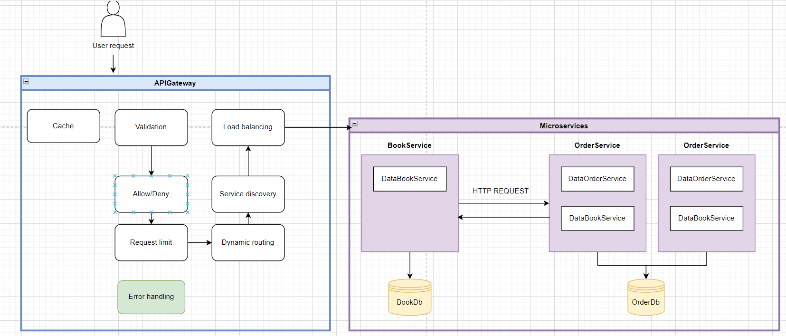

# Online BookStore 

### Microservices Relevance: 

The online bookstore represents a complex application with multiple 
moving parts. Implementing it as microservices will enhance modularity, 
allowing different components to evolve independently and scale based on 
their workload. Here's why microservices are suitable for our application:

**Modularity:** Different parts of the bookstore, such as inventory management 
and order processing, can evolve at their own pace without affecting others.

**Scalability:** During peak sale times, order processing may need to scale 
independently of the inventory management service.

**Maintenance:** Bugs and issues can be addressed in one service without the need to bring down the entire application.


Real-world example:

**Facebook:** Initially a monolithic application, Facebook shifted to a 
microservices approach to scale efficiently. Each feature like Messenger, 
News Feed, etc., can be seen as a separate microservice.


### Defined Service Boundaries

We have two main services:

**Books Service:** Manages the book inventory.

**Orders Service:** Processes and manages customer orders.

### Technology Stack and Communication Patterns

**Books Service:**

1. Language: C#
2. Framework: .NET Core
3. Communication: RESTful API for synchronous communication.

**Orders Service:**

1. Language: C#
2. Framework: .NET Core
3. Communication: RESTful API for synchronous communication. 
4. Inter-service communication with the Books Service to check book availability.

### Design Data Management

**Data Strategy:**

1. Opt for separate databases for each service. This ensures data encapsulation and service autonomy.
2. Use APIs for data access and mutation.

**Endpoints:**

**Books Service:**

1. GET /books: Retrieves all books.
2. GET /books/{bookId}: Retrieves a specific book.
3. POST /books: Adds a new book.
4. PUT /books/{bookId}: Updates an existing book.

**Orders Service:**

1. POST /orders: Places a new order.
2. GET /orders: Retrieves all orders.
3. GET /orders/{orderId}: Retrieves a specific order.
4. DELETE /orders/{orderId}: Deletes an order.

**Data Format:**

For our services, we'll use JSON as the primary data format. 
For instance, a book might be represented as:

```
{
    "id": 123,
    "title": "Sample Book",
    "author": "John Doe",
    "price": 19.99,
    "inStock": true
}
```

Communication between microservices

Endpoint in Books Service:
Endpoint: /books/{bookId}/availability
HTTP Method: GET
Description: Check if a book is available based on its ID.

### Set Up Deployment and Scaling

**Containerization:** Docker will be used to containerize each service, 
ensuring that the service runs consistently across different environments.

**Orchestration:** Kubernetes will manage the deployment, scaling, and 
operation of the application containers across clusters of hosts.



API documentation:
https://documenter.getpostman.com/view/23334469/2s9YRE1Wek


New-Item -ItemType Directory -Force -Path .\redis-data\node1
New-Item -ItemType Directory -Force -Path .\redis-data\node2
New-Item -ItemType Directory -Force -Path .\redis-data\node3

New-Item -ItemType File -Force -Path .\redis-data\node1\nodes.conf
New-Item -ItemType File -Force -Path .\redis-data\node2\nodes.conf
New-Item -ItemType File -Force -Path .\redis-data\node3\nodes.conf

icacls .\redis-data\node1\nodes.conf /grant Everyone:F
icacls .\redis-data\node2\nodes.conf /grant Everyone:F
icacls .\redis-data\node3\nodes.conf /grant Everyone:F
