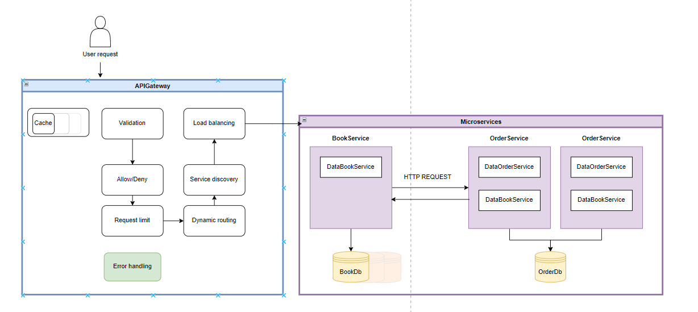

# Online BookStore

See the Postaman collection bellow
https://documenter.getpostman.com/view/23334469/2s9YRE1Wek

Just press run in browser and magic happens

### Run it

https://hub.docker.com/repository/docker/craevscaia/pad

Copy the images from the docker repository.
Run the instances:

4 instances of microservices

2 databases

1 api-gateway

1 service-discovery

### Trip Circuit Breaker if multiple reroutes happen

The Circuit Breaker pattern is a design pattern used in software development to detect failures and
encapsulate the logic of preventing a failure from constantly recurring during maintenance,
temporary external system failure, or unexpected system difficulties.

Circuit Breaker pattern detect these failures and "trip" the circuit breaker,
which prevents further communication with that service until it has had a chance to recover.

By "multiple re-routes" is meant that the service is trying to connect to another service,
and that service is not responding properly, it could adapt the code to throw an exception when a reroute is detected.

The circuit breaker would then count these exceptions, and if they reach the threshold,
it would trip the circuit, preventing further reroutes and giving the system time to recover.

### Service High Availability

1. Ensure services are stateless and can be scaled horizontally.
2. Use a load balancer to distribute traffic.
3. Deploy services in a containerized environment like Kubernetes for easy scaling and management.
4. Health Checks - implement monitoring tools to keep track of the application’s health and performance.
5. Set up alerts to notify when something goes wrong, or the response time goes above a certain threshold.

### Grafana and Prometheus stack. Aggregate data from all services

Logging and monitoring are essential for maintaining the health, performance, and reliability of the applications.

1. **Grafana and Prometheus:** This is a powerful way to monitor and visualize the system's metrics.

**Grafana:** This is an open-source platform for monitoring and observability. 
It allows to query, visualize, alert on, and understand the metrics no matter where they are stored.

**Key Features:** 

Dashboard Creation: Create and share dynamic dashboards that display changes in your data in real time.

Data Visualization: Offers various types of charts, graphs, and alerts for data visualization.

Data Sources Integration: Supports many data sources including Prometheus, InfluxDB, ElasticSearch, and more.

Alerting: Set up alerts based on the data patterns or thresholds.

**Prometheus:** This  is an open-source system monitoring and alerting toolkit. 
It's particularly good at collecting and storing time-series data.

**Key Features:**

Time Series Data: Collects and stores data as time series, allowing for high-dimensional data models.

Powerful Queries: Has a powerful query language (PromQL) for aggregating and processing data.

Service Discovery: Supports various service discovery mechanisms for finding services to monitor.

Built-in Alerting: Offers alerting functionalities, which can be integrated with external systems.

### Implement microservice-based 2 Phase Commits for a endpoint that create changes more than in one database

**What it is:** A 2 Phase Commit (2PC) is a type of atomic transaction that ensures 
consistency across distributed systems. The protocol achieves its goal even when some of the participants or
the coordinator fail during the protocol.

**How it relates:** Since there are two services (BookService & OrderService) 
that might need to update more than one database, using 2PC will ensure that changes 
to both databases are consistent.

This is complex and typically avoided, but if necessary:

1. Implement a transaction coordinator service.
2. Ensure all participating services can prepare, commit, and rollback transactions.

### Consistent Hashing for Cache

Consistent hashing is a distribution scheme that provides hash table functionality in
a way that the addition or removal of one slot does not significantly change
the mapping of keys to slots.

1. Consistent Hashing with Hazelcast.
2. Implement consistent hashing to ensure even distribution of cache keys.

**What it is:** Consistent hashing is a strategy to distribute data across multiple nodes 
(like cache servers) in a way that minimizes data reshuffling when nodes are added or removed.

**How it relates:** If you're scaling the cache (like the one in APIGateway), 
consistent hashing will help in effectively distributing the cache data.

### Cache High Availability

**What it is:** Achieving high availability in caching involves ensuring that the cache is available and responsive
at all times, even in the event of failures.
This usually means having redundancy, replication,
and potentially a load balancer to distribute the requests.

**How it relates:** In the APIGateway, if the cache fails, it could impact the 
performance of the services. Implementing cache replication or having a backup cache can 
ensure high availability.

1. Set up a Redis Cluster for distributed caching with high availability.

### 2 Phase Commits Long-Running Saga Transactions with Coordinator

**What it is:** Sagas are a way to manage long-running transactions by breaking them 
into smaller, isolated transactions.

**How it relates:** For complex business operations that span across services, 
using Sagas ensures that even if one step fails, the entire operation can be rolled back 
or compensated.

Orchestration- one central point that notify service what to do and based on the response
tells which will be the next step

### Database redundancy/replication + failover (one database, min 4 repl.)

**What it is:** This ensures that the databases are always available and can handle failures.

**How it relates:** Both BookDb and OrderDb in the system should have multiple replicas 
(at least 4 as mentioned). If one fails, traffic can be rerouted to a replica.

### Create a Data Warehouse that will be periodically updated with all data from the databases.

**What it is:** A large centralized database that integrates data from different sources.

**How it relates:** Periodically, you can move data from both BookDb and OrderDb to this warehouse for complex queries, analytics, and reporting.

